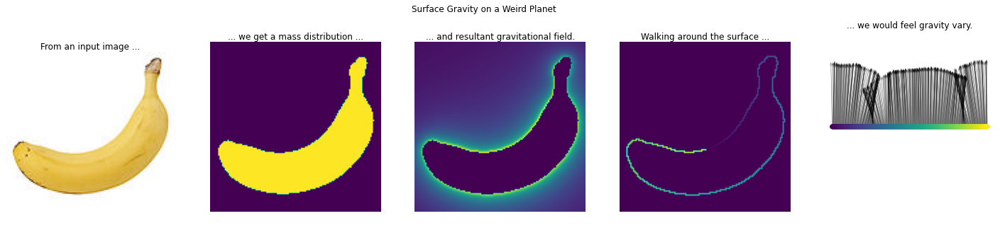

# maths-whimsy
Coding interesting maths problems; reference for techniques

## contents

### machine learning
* [Confusion Sankey](confusion_sankey.ipynb) - visualising classifier results or evaluation as Sankey diagrams, instead of typical confusion matrixes.

### physics
* [Square planet gravity](square_planet_gravity.ipynb) - visualisations and numpy implementations for calculating gravitational fields around arbitraty planet shapes.
* [Weird planet gravity](weird_planet_gravity.ipynb) - visualising gravity around and on the surface of weirdly shaped planets (at least arbitraty 2d cross sections)
* [Lagrange gravity](gravity_lagrange.ipynb) - visualising orbital zones around a rotating planet-moon system

### CAD
* [Moving shapes constraints](moving_shapes_constraints.ipynb) - simple bounds and constraints for moving 3D shapes with helpful behaviours
