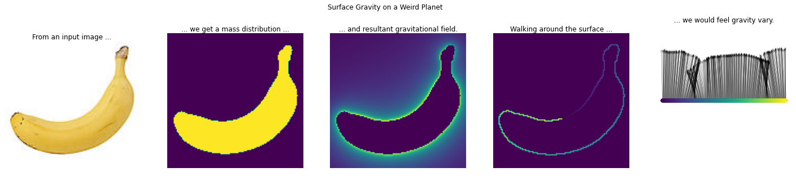

# maths-whimsy
Coding interesting maths problems; reference for techniques

## contents

### CAD
* [Moving shapes constraints](cad/moving_shapes_constraints.ipynb) - simple bounds and constraints for moving 3D shapes with helpful behaviours

* [Rotating shapes constraints](cad/rotating_shapes_constraints.ipynb) - rotation extension to movement constraints

### graphs & matrices

* [graph_tool bipartite](graph_tool_bipartite.ipynb) - using graph_tool & numpy to do bipartite projections from Python (fast and memory-intensive)
* [numpig](numpig.ipynb) - specific example of a map reduce approach in numpy to process large matrices with limited memory

### machine learning
* [Confusion Sankey](ml/confusion_sankey.ipynb) - visualising classifier results or evaluation as Sankey diagrams, instead of typical confusion matrixes.

### physics
* [Square planet gravity](physics/square_planet_gravity.ipynb) - visualisations and numpy implementations for calculating gravitational fields around arbitraty planet shapes.
* [Weird planet gravity](physics/weird_planet_gravity.ipynb) - visualising gravity around and on the surface of weirdly shaped planets (at least arbitraty 2d cross sections)
* [Lagrange gravity](physics/gravity_lagrange.ipynb) - visualising orbital zones around a rotating planet-moon system

### visualisation

* [Odometer](vis/odometer.ipynb) - Display a float as a mechanical odometer readout
* [Map projection](vis/map_projection_vis.ipynb) - Visualising map coordinate projections with squash-stretch quiver plot
