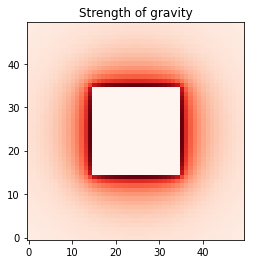

# maths-whimsy
Coding interesting maths problems; reference for techniques

## contents

* [Square planet gravity](square_planet_gravity.ipynb) - visualisations and numpy implementations for calculating gravitational fields around arbitraty planet shapes.
* [Confusion Sankey](confusion_sankey.ipynb) - visualising classifier results or evaluation as Sankey diagrams, instead of typical confusion matrixes.
* [Lagrange gravity](gravity_lagrange.ipynb) - visualising orbital zones around a rotating planet-moon system
